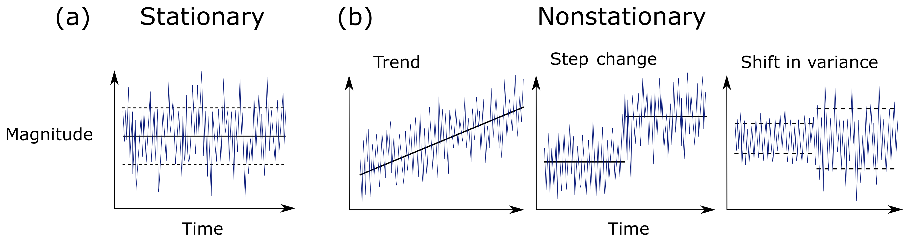
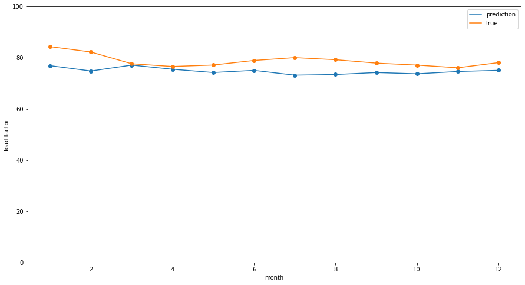

 &emsp;
 &emsp;
 &emsp;
 &emsp;
 &emsp;
 &emsp;

Table of Contents
=================

* [Cirium's HackAI Challenge - 2023](#ciriums-hackai-challenge---2023)
   * [Task](#task)
      * [Datasets](#datasets)
      * [Aim](#aim)
   * [Solution](#solution)
      * [Approach](#approach)
      * [Conclusion](#conclusion)
      * [Contributors](#contributors)

# Cirium's HackAI Challenge - 2023

## Task

The aim of this hackathon was to forecast a complex time series over a multi-period horizon.

### Datasets
To produce the forecasts, Cirium provided us with several datasets:
- **Airline Type:** The general business model followed by the airline
- **Seats:** How many seats will be offered by the airline at the prediction point one year into the future aggregated by year, month, airline, departing and arriving country
- **Covid:** A variety of covid related datapoints offered at the daily resolution for countries
- **GDP:** Quarterly reported and forecasted Gross Domestic Product for selected countries (includes several aggregated indexes)
- **Training & Validation Load Factors:** For several airlines, you’ll receive a mixture of reported load factor information at the yearly, quarterly and monthly level. The data does have gaps, and reporting lags
- **Lookup tables** for airlines & countries to help join datasets

These datasets have lags and variability in reported load factors. The actual data for 10 airlines is provided as a validation dataset.

***We have been asked to not publish the data and we respect Cirium's request. All data used to train the models have been expunged.***

### Aim 
The aim is to forecast load-factor forecasts for 50 airlines, system-wide (how full on average will the airline’s planes be). The submissions are then evaluated using the MAPE metric, with the top 6 teams presenting their approach and findings to a panel of judges who determine winning teams.

## Solution

An overview of our teams solution to the problem is given in the [presentation](./present.pptx), and a summary of the presentation is given below.

### Approach

The approach follows a series of steps to preprocess and understand the datasets before training the model:

1. **Dataset Understanding**: The Airlines and Country datasets are treated as lookup tables for merging purposes. The airline dataset reveals that some airlines have multiple airline types, necessitating unique mappings. To address this, an embedding approach is used to represent each airline instance uniquely.

2. **Encoding COVID and GDP Data**: The COVID data is encoded using the stringency index, which ranges from 0 to 100 and includes indicators like travel bans. The GDP dataset requires standardization and interpolation to match the sampling frequency of other features used for training the models.

3. **Dataset Linking**: The operating airline IATA code is used to fetch the airline type from the airline dataset. Similarly, the departure and arrival country IATA codes are utilized to obtain the ISO codes, which are then used to fetch the corresponding COVID data. The seats dataset serves as the primary dataset that links all the other datasets together.

4. **Load Factor Dataset**: The load factor dataset contains the target feature. It is observed that some load factor values are correctly zero, corresponding to cargo airlines. The validation dataset is used to optimize the model and minimize the generalization loss. All features in the validation dataset need to be interpolated or merged over the specified time-frame.

5. **Preprocessing**: The preprocessing stage begins with ensuring consistency in column names and date time formats across the datasets. The sampling frequency is set to monthly, with annual and quarterly data points being dropped due to their low count. Various methods are explored to handle missing values (NaN), and the chosen approach is to fill missing data points with the mean value and a small amount of noise.

6. **Stationarity**: A check for stationarity is performed using QQ plots, revealing that the data is non-stationary. Stationarity is crucial for certain models like ARIMA, but due to time constraints, the decision is made to use Long Short-Term Memory (LSTM) models. LSTMs are capable of capturing the non-linear and non-stationary nature of time series data, reducing forecasting errors.

  
   
  <em>
  <a href="https://www.google.com/url?sa=i&url=https%3A%2F%2Fhess.copernicus.org%2Farticles%2F25%2F3897%2F2021%2F&psig=AOvVaw35fMxWC_xsjAmbeoV41cl-&ust=1687205184854000&source=images&cd=vfe&ved=0CBAQjRxqFwoTCICpqbTRzf8CFQAAAAAdAAAAABAE">Image source</a></em>

7. **Feature Engineering**: Departure and arrival country features in the seats dataset are not considered for the model. Instead, the total number of global seats for each airline is calculated. The months are encoded in a cyclical fashion to capture seasonal patterns. The airline types are embedded in a binary format, reflecting different features of the passenger load factor.

8. **Stringency Index Prediction**: The available stringency index dataset does not cover the required months for the validation or test datasets. To address this, a predictive model is created using XGBoost to estimate the average global stringency index. This model takes the month and year data from the test dataset to generate a new feature. Although the model's performance is not optimal, it is still utilized in the solution.

9. **Model Selection**: Various time-series models such as ARIMA, decision trees, and Prophet are considered. However, due to the non-stationarity of the data, LSTM models are chosen for their ability to handle non-linear and non-stationary data. The LSTM model consists of 2 layers and requires an 8-month sequence length for training. High dropout is applied to mitigate overfitting.

  
   
  <em>
  <a href="https://www.google.com/url?sa=i&url=https%3A%2F%2Fcolah.github.io%2Fposts%2F2015-08-Understanding-LSTMs%2F&psig=AOvVaw1vRS52GHhZ273_TR28s2OG&ust=1687205140003000&source=images&cd=vfe&ved=0CBAQjRxqFwoTCMCxyIzPzf8CFQAAAAAdAAAAABAJ">Image source</a></em>

10. **Potential Improvements**: If time had allowed, several improvements would have been implemented. These include incorporating GDP data by standardizing the measure and interpolating it to achieve a monthly sampling frequency. Models such as ARIMA, decision trees, and Prophet would have been trained and compared with the LSTM model. The stringency index would have been considered on a per-nation basis instead of using the average global index. The data would have been made stationary and tested using the augmented Dickey-Fuller test. The XGBoost model for predicting the stringency index would have been further improved. Additionally, exploring models trained on different sampling frequencies could have been valuable.

  

11. **Importance of Airline Type Embedding**: The binary embedding of airline types is considered a crucial feature for predicting the passenger load factor. This encoding scheme effectively captures the impact of different airline types, contributing to the better performance of the model.

12. **Challenges**: The datasets pose challenges related to overlapping seasonality and changing feature importance. For example, different countries and hemispheres experience different seasons, and global and national holidays affect passenger load factor differently. Additionally, some features may become less important over time, as observed with the diminishing importance of the stringency index post-COVID.

### Conclusion

This solution provides a comprehensive approach to preprocessing and understanding various datasets to predict the passenger load factor. The use of embeddings, encoding schemes, and LSTM models helps capture the complex patterns in the data. Although there are potential areas for improvement and challenges encountered, the solution lays the foundation for accurate load factor forecasting.

Please refer to the [project code](TimeSeries.ipynb) for more details on the implementation and model training.

### Contributors

`Benjamin Sanati`

`Joel Edgar`

Due to our performance in the hackathon, the contributors were given the opportunity to do summer internships at Cirium.